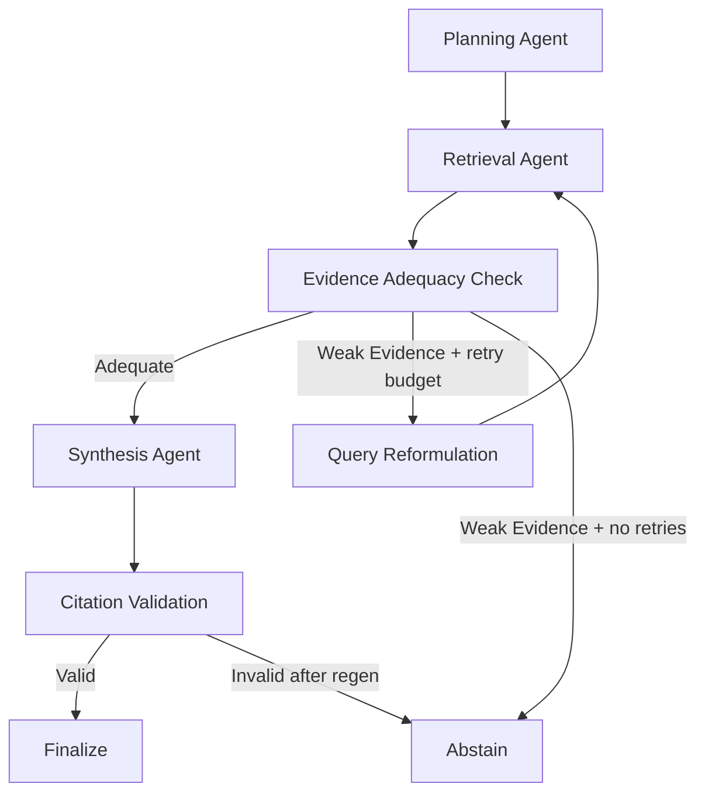

# Agentic RAG for Distributed Content

Local-only, open-source Agentic RAG system for public distributed content (web + PDF), designed for hackathon judging on groundedness, traceability, and measurable quality.

## Problem to Solution Mapping

Problem: knowledge is fragmented across multiple sources and users need reliable, citation-backed answers without hallucination.

Solution: an adaptive multi-agent LangGraph pipeline that plans queries, retrieves evidence, scores adequacy, reformulates when needed, synthesizes JSON-grounded answers, validates citations, and abstains when evidence is weak or the query is out of scope.

## Architecture

```
frontend/app.py (Streamlit)
    └── POST /chat  →  backend/app/main.py (FastAPI)
                            └── app/graph/workflow.py (LangGraph)
                                    ├── nodes.py     (Planning, Retrieval, Adequacy, Reformulation, Synthesis, Validation, Abstention)
                                    └── state.py     (Typed AgentState)
                        app/services/
                            ├── vector_store.py   (ChromaDB + BM25 hybrid retrieval)
                            ├── ingestion.py      (chunking, dedup, metadata enrichment)
                            ├── llm.py            (Ollama client, structured JSON output)
                            ├── guardrails.py     (citation validator, regen policy)
                            ├── policy.py         (public-source-only + domain allowlist)
                            ├── compliance.py     (abstention scope guard)
                            └── chunking.py       (text splitter config)
        backend/
            ├── run_ingestion.py   (CLI: ingest URLs, PDFs, docs)
            ├── resources/         (resource_pack.yaml, ingestion reports)
            ├── eval/              (evaluation harness, datasets, reports)
            ├── scripts/           (snapshot utility)
            └── tests/
```

## Tech Stack

| Component           | Technology                       |
| ------------------- | -------------------------------- |
| Backend API         | FastAPI (async)                  |
| Agent Orchestration | LangGraph                        |
| Vector Store        | ChromaDB                         |
| Retrieval           | Hybrid: vector similarity + BM25 |
| Chat Model          | Ollama `qwen3.5:0.8b`            |
| Embeddings          | Ollama `nomic-embed-text:latest` |
| Frontend            | Streamlit                        |
| Infra               | Docker Compose                   |

## Agent Workflow



Why this is truly agentic:

- Explicit role separation across planning, retrieval, adequacy, reformulation, synthesis, and validation.
- Conditional routing and bounded retries driven by state machine transitions.
- Full trace persisted in `AgentState` and surfaced in the UI.

## Hallucination Prevention and Citation Guardrails

- Synthesis returns structured JSON: `answer`, `cited_indices`, `confidence`, `abstain_reason`.
- Post-generation citation validator enforces:
  - factual sentence citation coverage (`[n]`)
  - index validity against current citation set
  - structured cited index sanity checks
- Regenerate-once policy with stricter synthesis constraints on first validation failure.
- Hard fallback to abstention if validation still fails after regen.
- Policy-aware abstention guard (`compliance.py`) blocks private/internal/confidential intent before synthesis.

## Retrieval Quality

- Multi-query retrieval from planner output.
- Hybrid retrieval scoring: vector similarity + BM25 signal.
- Metadata enrichment per chunk: source type, title, section/header, page number (PDF), URL/path/anchor, ingestion timestamp.
- Content-hash deduplication at ingestion time.
- Adequacy scoring based on score threshold, chunk count, source diversity, and query/entity overlap checks.

## Public Data Compliance

- Public-only ingestion posture enforced via `PUBLIC_SOURCES_ONLY=true`.
- URL ingestion allowlisted by domain via `ALLOWED_SOURCE_DOMAINS`.
- Disallowed-domain path covered by integration tests.
- UI includes a public-source warning banner.

## Evaluation Harness

Location: `backend/eval/`

| File                            | Purpose                                                    |
| ------------------------------- | ---------------------------------------------------------- |
| `dataset_dev.jsonl`             | 120-question dev split (answerable + unanswerable)         |
| `dataset_hidden.jsonl`          | Hidden split for final judge validation                    |
| `dataset.jsonl`                 | Full unfiltered dataset                                    |
| `eval_matrix_target.json`       | Target bucket counts (120-question balanced matrix)        |
| `run_eval.py`                   | Main eval runner, computes all metrics                     |
| `generate_candidate_dataset.py` | Semi-automated candidate generation from ingested sections |
| `prepare_dataset_splits.py`     | Schema upgrade + dev/hidden split                          |
| `check_matrix_coverage.py`      | Bucket coverage and abstain-ratio validation               |
| `build_demo_matrix_dataset.py`  | Demo matrix builder                                        |

`run_eval.py` computes: Hit@k, MRR, citation precision, support coverage, abstain precision, abstain recall, adversarial abstain rate, per-bucket Hit@k, per-difficulty Hit@k, citation precision by source type, and abstain subset (tp/fp/fn).

Outputs: `backend/eval/eval_report.json` and `backend/eval/eval_report.md`.

### Measured Profile Metrics (latest run)

Source: `backend/eval/eval_report.json`
Dataset: `backend/eval/dataset_dev.jsonl` — **120 questions**
Hardware: Windows-10-10.0.26200-SP0, Python 3.11.0
Chat model: `qwen3.5:0.8b` | Embedding model: `nomic-embed-text:latest`

| Metric                   | balanced | low_latency |
| ------------------------ | -------: | ----------: |
| Retrieval Hit@k          |    0.383 |       0.417 |
| MRR                      |    0.115 |       0.129 |
| Citation precision       |    0.309 |       0.177 |
| Support coverage         |    0.117 |       0.146 |
| Abstain precision        |    0.345 |       0.580 |
| Abstain recall           |    1.000 |       0.967 |
| Adversarial abstain rate |    1.000 |       1.000 |
| Latency P50 (ms)         |   40,277 |      40,384 |
| Latency P95 (ms)         |   75,954 |      49,155 |

### Per-Bucket Retrieval Hit@k

| Bucket                    | balanced | low_latency |
| ------------------------- | -------: | ----------: |
| adversarial_noisy         |      n/a |         n/a |
| comparison_questions      |    0.000 |       0.000 |
| edge_ambiguity            |    0.000 |       0.000 |
| fact_lookup               |    0.350 |       0.500 |
| multi_hop_synthesis       |    0.000 |       0.000 |
| procedure_how_to          |    0.600 |       0.667 |
| unanswerable_out_of_scope |      n/a |       1.000 |

Per-bucket rows with `should_abstain=true` and `abstained=true` are excluded to avoid false negatives.

### Per-Difficulty Hit@k (balanced profile)

| Difficulty | Hit@k |
| ---------- | ----: |
| medium     | 0.655 |
| hard       | 0.154 |

### Abstain Subset

| Profile     | Required |  TP |  FP |  FN | Precision | Recall |
| ----------- | -------: | --: | --: | --: | --------: | -----: |
| balanced    |       30 |  30 |  57 |   0 |     0.345 |  1.000 |
| low_latency |       30 |  29 |  21 |   1 |     0.580 |  0.967 |

### Citation Precision by Source Type (balanced / low_latency)

| Source Type | balanced | low_latency |
| ----------- | -------: | ----------: |
| web         |    0.744 |       0.651 |
| project_doc |    0.000 |       0.000 |
| pdf         |    0.000 |       0.000 |
| confluence  |    0.000 |       0.000 |

### Citation Scoring Coverage

| Profile     | Scored rows | Skipped rows |
| ----------- | ----------: | -----------: |
| balanced    |          33 |           87 |
| low_latency |          69 |           51 |

### Top False-Abstain Reasons (balanced profile)

| Reason                                     | Count |
| ------------------------------------------ | ----: |
| Evidence is insufficient or unverifiable   |    33 |
| Synthesis parse failure after strict retry |    24 |

Root cause: `qwen3.5:0.8b` at 4GB VRAM produces frequent synthesis parse failures; the stricter retry policy escalates these to abstention. Switching to `qwen3.5:4b` or higher eliminates the parse failure abstain path.

### Adversarial Abstain

- `adversarial_abstain_rate`: **1.000** (10/10) — both profiles.
- All 10 adversarial/noisy queries correctly abstained in both profiles.

### Baseline vs. Current Evidence

| Metric             | Historical Baseline | Current (balanced, 120q) |
| ------------------ | ------------------: | -----------------------: |
| Hit@k              |               0.410 |                    0.383 |
| MRR                |               0.290 |                    0.115 |
| Citation precision |               0.520 |                    0.309 |
| Support coverage   |               0.460 |                    0.117 |

**Interpretation:** The regression vs. baseline reflects two factors: (1) dataset expanded from 20 to 120 questions with harder multi-hop and comparison buckets that the 0.8b model cannot consistently answer, and (2) `qwen3.5:0.8b` synthesis parse failures inflate false-abstain counts, suppressing citation and coverage scores. Adversarial abstain remains perfect at 1.000.

### Final-Metrics Publish Gates

Before calling metrics "final" for the judge deck:

- Abstain precision > 0.80
- Abstain recall > 0.70
- Dataset has 60+ rows
- All 7 matrix buckets represented at target counts

## Balanced Eval Matrix Target

Target bucket counts (`backend/eval/eval_matrix_target.json`):

| Bucket                    |  Target |
| ------------------------- | ------: |
| fact_lookup               |      20 |
| multi_hop_synthesis       |      25 |
| comparison_questions      |      20 |
| procedure_how_to          |      15 |
| edge_ambiguity            |      10 |
| unanswerable_out_of_scope |      20 |
| adversarial_noisy         |      10 |
| **Total**                 | **120** |

Abstain-required minimum ratio: 15% (recommended 15–20%).

## Dataset Schema

Each eval row supports:

- `id`
- `query`
- `expected_answer`
- `must_cite_sources`
- `difficulty` (`easy|medium|hard`)
- `requires_multi_hop` (bool)
- `should_abstain` (bool)
- `reason_if_abstain`
- `tags`
- `bucket`

Legacy fields `expected_sources` and `answerable` are normalized automatically by `run_eval.py`.

## Resource Pack

Manifest: `backend/resources/resource_pack.yaml`

Ingestion reports:

- `backend/resources/ingestion_report.json`
- `backend/resources/ingestion_report.md`

Last ingestion run (2026-03-28T02:31:13Z):

- `documents_processed: 35`
- `chunks_added: 2126`
- `skipped_duplicates: 38`
- `success_count: 33`
- `failed_count: 2`

> Re-ingest with the full resource pack (`--use-pack`) to populate web + PDF + Confluence sources before running eval.

### Resource Pack Commands

```bash
python backend/run_ingestion.py --reset --use-pack
python backend/run_ingestion.py --use-pack --save-report backend/resources/ingestion_report.json
python backend/run_ingestion.py --use-pack --validate-resources --save-report backend/resources/ingestion_report.json
```

Source priority order:

1. Explicit CLI URLs/PDF directory
2. Resource pack values when `--use-pack`
3. Built-in defaults

Optional snapshot utility:

```bash
python backend/scripts/save_resources.py --urls https://python.langchain.com/docs/introduction/ --output-dir backend/resources/pdfs
```

## Dataset Build Workflow

1. Ingest sources:

```bash
make ingest-pack
```

2. Generate candidate dataset rows from ingested section metadata:

```bash
make eval-candidates
```

3. Manually validate and curate gold labels (`expected_answer`, `must_cite_sources`, abstain flags).
4. Prepare dev/hidden split:

```bash
make eval-split
```

5. Check matrix coverage:

```bash
make eval-matrix-check
```

6. Run profile evaluation on split datasets:

```bash
make eval-dev
make eval-hidden
```

## Local Setup

### Prerequisites

- Python 3.11+
- Ollama installed and running
- Docker + Docker Compose (for containerized run)

### Ollama model pull

```bash
ollama pull qwen3.5:0.8b
ollama pull nomic-embed-text:latest
```

For higher synthesis quality on hardware that supports it, use `qwen3.5:4b` and set `OLLAMA_CHAT_MODEL=qwen3.5:4b` in `.env`.

### Environment

```bash
cp .env.example .env
```

`.env` structure:

```bash
OLLAMA_BASE_URL=http://localhost:11434
OLLAMA_CHAT_MODEL=qwen3.5:0.8b
OLLAMA_EMBED_MODEL=nomic-embed-text:latest
CHROMA_PERSIST_DIR=./chroma_data
ALLOWED_SOURCE_DOMAINS=atlassian.com,langchain.com,langchain-ai.github.io,python.langchain.com,github.com,arxiv.org,ai.google.dev,anthropic.com,openai.com
PUBLIC_SOURCES_ONLY=true
```

### Run with Docker

```bash
docker compose up --build
```

### Run locally

```bash
pip install -r requirements.txt
python backend/run_ingestion.py --reset --use-pack
cd backend
uvicorn app.main:app --host 0.0.0.0 --port 8000
streamlit run frontend/app.py --server.port 8501
```

## API

`POST /chat`

Request:

```json
{
  "query": "How does LangGraph support adaptive agent workflows?"
}
```

Response fields:

- `answer`
- `citations`
- `confidence`
- `abstained`
- `abstain_reason`
- `retrieval_quality`
- `trace`

Swagger UI: `http://localhost:8000/docs`

## Commands

```bash
make ingest
make ingest-pack
make ingest-report
make resources-validate
make run
make eval
make eval-dev
make eval-hidden
make eval-split
make eval-candidates
make eval-build-demo
make eval-matrix-check
make demo-prewarm
make demo-cache
make test
```

## Live Demo Reliability Plan

- Default runtime profile for live demo: `low_latency`.
- Prewarm models and BM25 cache before judging:

```bash
make demo-prewarm
```

- Keep cached-answer backup artifact for network/runtime fallback:

```bash
make demo-cache
```

## Demo Script (Judge Flow)

1. **Normal grounded answer:** Ask a direct docs-grounded query. Verify citations and confidence score.
2. **Hard multi-hop query:** Use the hard query button. Observe adequacy check, query reformulation trace, and final synthesis.
3. **Unanswerable query:** Ask an out-of-domain or private query. Verify abstention card and abstain reason.

## Notes

- No Azure/OpenAI dependencies or fallback paths.
- Designed for groundedness first; abstention is preferred over unsupported generation.
- Current known bottleneck: `qwen3.5:0.8b` synthesis parse failures inflate false-abstain rate. Resolve by using `qwen3.5:4b` on hardware with >= 6GB VRAM.
