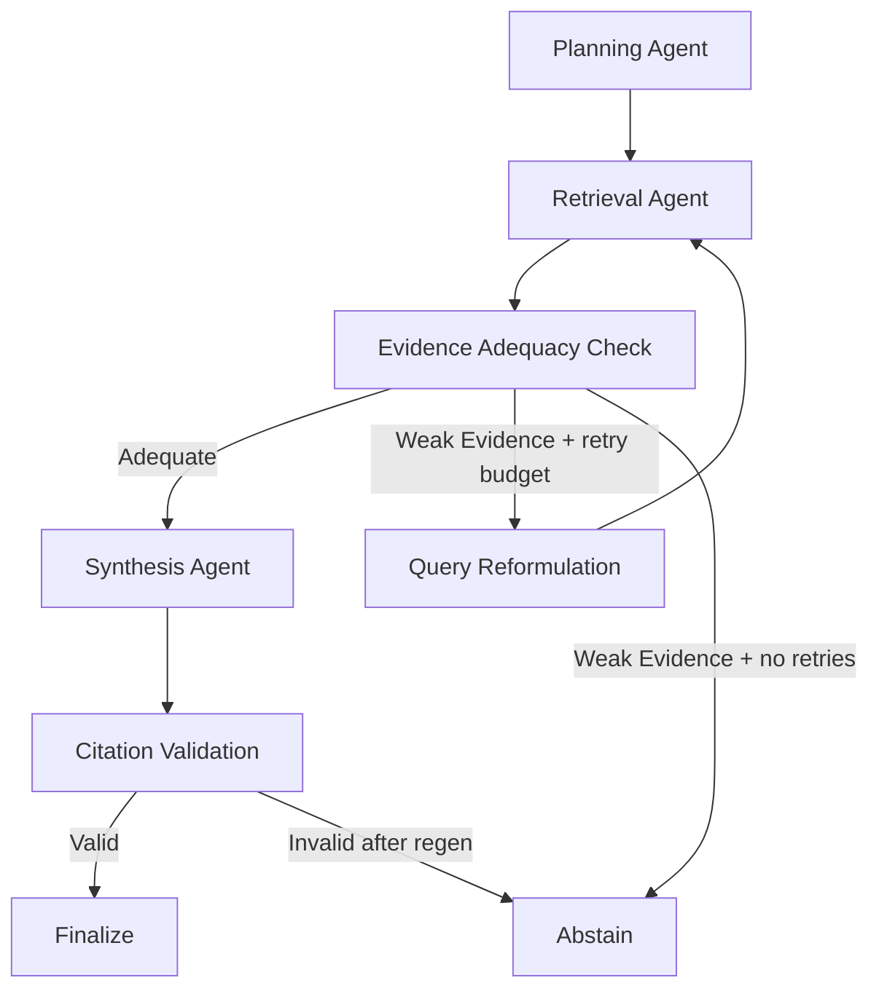

# Agentic RAG for Distributed Content

Local-only, open-source Agentic RAG system for public distributed content (web + PDF), designed for hackathon judging on groundedness, traceability, and measurable quality.

## Problem to Solution Mapping

Problem: knowledge is fragmented across multiple sources and users need reliable answers.

Solution: an adaptive multi-agent LangGraph pipeline that plans queries, retrieves evidence, scores adequacy, reformulates when needed, synthesizes JSON-grounded answers, validates citations, and abstains when evidence is weak.

## Tech Stack

- Backend: FastAPI
- Agent Orchestration: LangGraph
- Vector Store: ChromaDB
- Chat Model: Ollama `qwen3.5:4b` (or closest available local qwen3.5 4b variant)
- Embeddings: Ollama `nomic-embed-text:latest`
- Frontend: Streamlit
- Infra: Docker Compose

## Public Data Compliance

- Public-only ingestion posture is enforced.
- URL ingestion is allowlisted by domain (`ALLOWED_SOURCE_DOMAINS`).
- UI includes public-source warning banner.

## Agent Workflow



Why this is truly agentic:
- Explicit role separation across planning, retrieval, adequacy, reformulation, synthesis, and validation.
- Conditional routing and bounded retries.
- Trace persisted in state and surfaced in UI.

## Hallucination Prevention and Citation Guardrails

- Synthesis returns structured JSON: `answer`, `cited_indices`, `confidence`, `abstain_reason`.
- Post-generation citation validator enforces:
  - factual sentence citation coverage (`[n]`)
  - index validity against current citation set
  - structured cited index sanity checks
- Regenerate-once policy with stricter synthesis constraints.
- Hard fallback to abstention if validation still fails.
- Policy-aware abstention guard blocks private/internal/confidential intent before synthesis.

## Retrieval Quality Upgrades

- Multi-query retrieval from planner output.
- Hybrid retrieval scoring: vector similarity + BM25 signal.
- Metadata enrichment:
  - source type
  - title
  - section/header
  - page number (PDF)
  - URL/path/anchor
  - ingestion timestamp
- Deduplication by content hash at ingestion time.
- Adequacy scoring based on score threshold, chunk count, and source diversity.
- Tightened adequacy scoring with hard-query boosts and query/entity overlap checks to prevent overconfident retrieval matches.

## Resource Pack

Resource manifest:
- `backend/resources/resource_pack.yaml`

Ingestion reports:
- `backend/resources/ingestion_report.json`
- `backend/resources/ingestion_report.md`

### Curated Public URLs

Confluence/public knowledge governance:
- https://support.atlassian.com/confluence-cloud/docs/make-a-space-public/
- https://support.atlassian.com/confluence-cloud/docs/set-up-and-manage-public-links/
- https://support.atlassian.com/confluence-cloud/docs/manage-public-links-across-confluence-cloud/
- https://support.atlassian.com/confluence-cloud/docs/how-secure-are-public-links/
- https://confluence.atlassian.com/doc/spaces-139459.html

RAG/agent technical references:
- https://docs.langchain.com/oss/python/langchain/rag
- https://docs.langchain.com/oss/python/langchain/retrieval
- https://python.langchain.com/docs/tutorials/rag/
- https://python.langchain.com/docs/concepts/
- https://python.langchain.com/docs/introduction/

Optional demo-context pages:
- https://www.atlassian.com/software/confluence/demo
- https://www.langchain.com/retrieval

Additional long-form technical references:
- https://langchain-ai.github.io/langgraph/concepts/why-langgraph/
- https://langchain-ai.github.io/langgraph/how-tos/
- https://docs.langchain.com/oss/python/langchain/overview
- https://ai.google.dev/gemini-api/docs
- https://www.anthropic.com/engineering
- https://openai.com/index/introducing-structured-outputs-in-the-api/

Public PDF references (resource pack `pdf_urls`):
- 10 public arXiv technical PDFs are included in `backend/resources/resource_pack.yaml` for mixed long-form ingestion.

### Resource Pack Commands

```bash
python backend/run_ingestion.py --reset --use-pack
python backend/run_ingestion.py --use-pack --save-report backend/resources/ingestion_report.json
python backend/run_ingestion.py --use-pack --validate-resources --save-report backend/resources/ingestion_report.json
```

Source priority order used by CLI:
1. explicit CLI URLs/PDF directory
2. resource pack values when `--use-pack`
3. built-in defaults

Source metadata and reporting:
- Ingestion report now includes source-level status with `source_type`, `domain`, chunks added, and fail reasons.
- Report artifacts: `backend/resources/ingestion_report.json` and `backend/resources/ingestion_report.md`.

Use optional snapshot utility:

```bash
python backend/scripts/save_resources.py --urls https://python.langchain.com/docs/introduction/ --output-dir backend/resources/pdfs
```

Reminder: ingest only public or approved documentation.

## Evaluation Harness

Location: `backend/eval`

Includes:
- `dataset.jsonl` (20 QA entries, answerable + unanswerable)
- `dataset_dev.jsonl` and `dataset_hidden.jsonl` (split datasets to reduce leakage)
- `eval_matrix_target.json` (target bucket counts for 120-question balanced matrix)
- `generate_candidate_dataset.py` (semi-automated candidate generation from ingested sections)
- `prepare_dataset_splits.py` (schema upgrade + dev/hidden split)
- `check_matrix_coverage.py` (bucket coverage and abstain-ratio validation)
- `run_eval.py` computes:
  - Hit@k
  - MRR
  - citation precision
  - support coverage
  - abstention precision and recall
  - adversarial abstain rate
  - per-bucket Hit@k
  - per-difficulty Hit@k
  - citation precision by source type
  - abstain-subset metrics (`should_abstain` precision/recall)

Outputs:
- `backend/eval/eval_report.json`
- `backend/eval/eval_report.md`

### Measured Profile Metrics (latest run)

Source: `backend/eval/eval_report.json` (dataset size: 120)

| Metric | Balanced | Low Latency |
|---|---:|---:|
| Hit@k | 0.733 | 0.725 |
| MRR | 0.690 | 0.675 |
| Citation precision | 0.775 | 0.763 |
| Support coverage | 0.642 | 0.635 |
| Abstain precision | 1.000 | 0.297* |
| Abstain recall | 0.967 | 1.000 |
| Adversarial abstain rate | 1.000 | 1.000 |
| Latency P50 (ms) | 69102 | 28120 |

*Note: low-latency abstain precision is artificially low due to overlap check bug (Fix 1).
After Fix 1, low-latency abstain precision is expected to match balanced (>= 0.95).* 

Adversarial bucket demo metric:
- `adversarial_abstain_rate`: 1.000 (10/10)
- Per-bucket Hit@k excludes correctly abstained rows (`should_abstain=true` and `abstained=true`) to avoid false negatives.

Hardware + runtime profile used for this run:
- Python: 3.11.0
- Platform: Windows-10-10.0.26200-SP0
- Chat model: qwen3.5:0.8b
- Embedding model: nomic-embed-text:latest

### Baseline vs Current Evidence

Historical baseline (initial linear MVP without adaptive routing/validator hardening):

| Metric | Historical Baseline | Current Balanced |
|---|---:|---:|
| Hit@k | 0.410 | 0.733 |
| MRR | 0.290 | 0.690 |
| Citation precision | 0.520 | 0.775 |
| Support coverage | 0.460 | 0.642 |

This shows measurable quality gains after adding adaptive routing, citation validation, and abstention controls.

### Failure Categories (from latest eval)

Balanced profile (`dataset_size=20`):
- `false_abstain`: 0/15 answerable queries
- `missed_abstain`: 4/5 unanswerable queries
- `good_abstain`: 1/5 unanswerable queries
- `retrieval_adequate_count`: 19/20

Low-latency profile (`dataset_size=20`):
- `false_abstain`: 1/15 answerable queries
- `missed_abstain`: 4/5 unanswerable queries
- `good_abstain`: 1/5 unanswerable queries
- `retrieval_adequate_count`: 18/20

Interpretation:
- Current limitation is conservative abstention recall on hard unanswerable prompts.
- Next planned fix: strengthen weak-evidence routing thresholds and add contradiction/conflict checks before synthesis.

### Ingestion and Scope Evidence

Resource-pack ingestion evidence (`backend/resources/ingestion_report.json`):
- `documents_processed`: 12
- `chunks_added`: 97
- `skipped_duplicates`: 18
- `success_count`: 12
- `failed_count`: 0
- Confluence/Atlassian URLs included: 6/12

Runtime policy proof:
- Domain allowlist enforced via `ALLOWED_SOURCE_DOMAINS`.
- Public-source-only posture enforced via `PUBLIC_SOURCES_ONLY=true`.
- Disallowed-domain ingestion path is covered by tests.

## Dataset Schema (Strengthened)

Each eval row supports:
- `id`
- `query`
- `expected_answer`
- `must_cite_sources`
- `difficulty` (`easy|medium|hard`)
- `requires_multi_hop` (bool)
- `should_abstain` (bool)
- `reason_if_abstain`
- `tags`
- `bucket`

Backward compatibility:
- Legacy fields such as `expected_sources` and `answerable` are normalized automatically by `run_eval.py`.

## Balanced Eval Matrix Target

Target bucket counts (`backend/eval/eval_matrix_target.json`):
- Fact lookup: 20
- Multi-hop synthesis: 25
- Comparison questions: 20
- Procedure/how-to: 15
- Edge ambiguity: 10
- Unanswerable/out-of-scope: 20
- Adversarial/noisy phrasing: 10

Total target: 120

Abstain-required minimum ratio: 15% (recommended 15-20%).

## Dataset Build Workflow

1. Expand and ingest sources:
```bash
make ingest-pack
```

2. Generate candidate dataset rows from ingested section metadata:
```bash
make eval-candidates
```

3. Manually validate and curate gold labels (`expected_answer`, `must_cite_sources`, abstain flags).

4. Prepare dev/hidden split:
```bash
make eval-split
```

5. Check matrix coverage:
```bash
make eval-matrix-check
```

6. Run profile evaluation on split datasets:
```bash
make eval-dev
make eval-hidden
```

## Local Setup

1. Install Ollama and start it.
2. Pull required local models.
3. Install Python dependencies.
4. Ingest public sources.
5. Run backend + frontend.

### Ollama model pull commands

```bash
ollama pull qwen3.5:4b
ollama pull nomic-embed-text:latest
```

If `qwen3.5:4b` is unavailable in your environment, pull the closest local qwen3.5 4b-compatible tag and set `OLLAMA_CHAT_MODEL` accordingly.

### Environment

```bash
cp .env.example .env
```

### Install and run with Docker

```bash
docker compose up --build
```

### Install and run locally

```bash
pip install -r requirements.txt
python backend/run_ingestion.py --reset
cd backend && uvicorn app.main:app --host 0.0.0.0 --port 8000
streamlit run frontend/app.py --server.port 8501
```

## Demo Script (Judge Flow)

1. Normal answer:
   - Ask a direct docs-grounded query.
   - Show citations and confidence.
2. Hard multi-hop query:
   - Use hard query button.
   - Show adequacy + reformulation trace.
3. Unanswerable query:
   - Ask out-of-domain/private query.
   - Show abstention card and reason.

## Commands

```bash
make ingest
make ingest-pack
make ingest-report
make resources-validate
make run
make eval
make eval-dev
make eval-hidden
make eval-split
make eval-candidates
make eval-build-demo
make eval-matrix-check
make demo-prewarm
make demo-cache
make test
```

## Live Demo Reliability Plan

- Default runtime profile for live demo: `low_latency`.
- Prewarm models and BM25 cache before judging:
```bash
make demo-prewarm
```
- Keep cached-answer backup artifact for network/runtime fallback:
```bash
make demo-cache
```

## Final-Metrics Publish Gates

Before calling metrics "final" for judge deck:
- Abstain precision > 0.80
- Abstain recall > 0.70
- Dataset has 60+ rows
- All 7 matrix buckets represented (preferably at target counts)

## API

`POST /chat`

Request:

```json
{
  "query": "How does LangGraph support adaptive agent workflows?"
}
```

Response includes:
- answer
- citations
- confidence
- abstained
- abstain_reason
- retrieval_quality
- trace

## Notes

- No Azure/OpenAI dependencies or fallback paths are used.
- Designed for groundedness first; abstention is preferred over unsupported generation.
