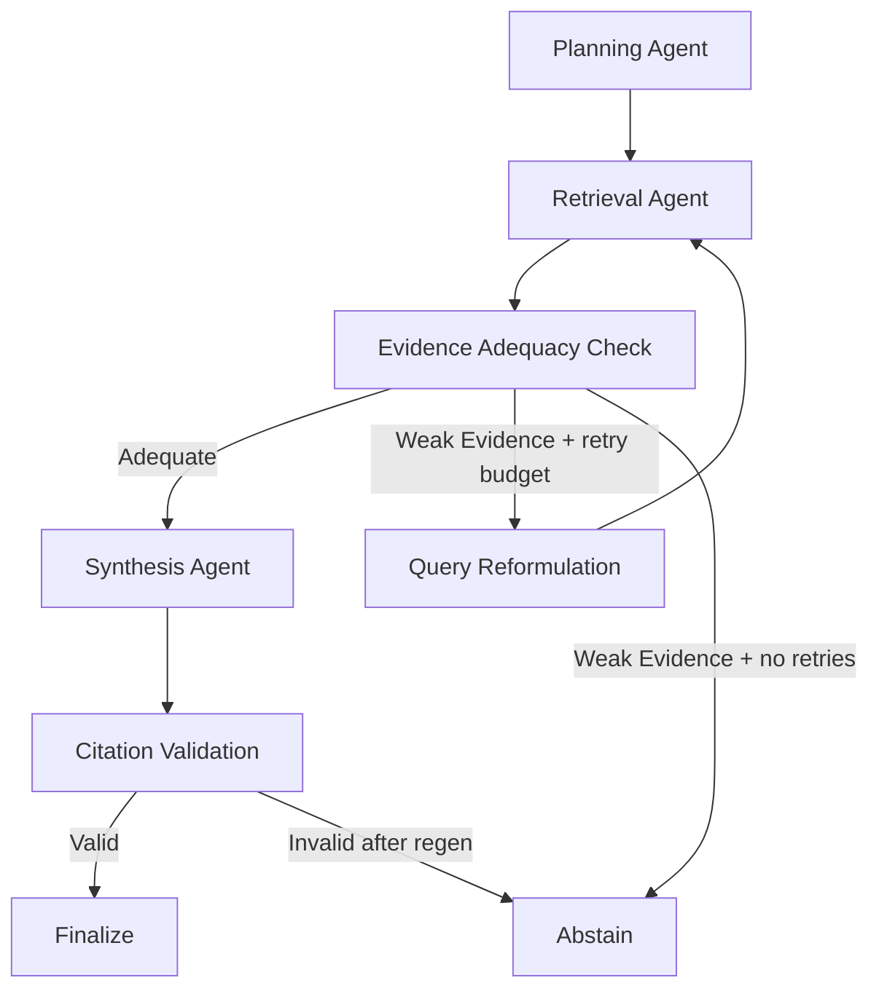

# Agentic RAG for Distributed Content

Local-only, open-source Agentic RAG system for public distributed content (web + PDF), designed for hackathon judging on groundedness, traceability, and measurable quality.

## Problem to Solution Mapping

Problem: knowledge is fragmented across multiple sources and users need reliable answers.

Solution: an adaptive multi-agent LangGraph pipeline that plans queries, retrieves evidence, scores adequacy, reformulates when needed, synthesizes JSON-grounded answers, validates citations, and abstains when evidence is weak.

## Tech Stack

- Backend: FastAPI
- Agent Orchestration: LangGraph
- Vector Store: ChromaDB
- Chat Model: Ollama `qwen3.5:4b` (or closest available local qwen3.5 4b variant)
- Embeddings: Ollama `nomic-embed-text:latest`
- Frontend: Streamlit
- Infra: Docker Compose

## Public Data Compliance

- Public-only ingestion posture is enforced.
- URL ingestion is allowlisted by domain (`ALLOWED_SOURCE_DOMAINS`).
- UI includes public-source warning banner.

## Agent Workflow



Why this is truly agentic:
- Explicit role separation across planning, retrieval, adequacy, reformulation, synthesis, and validation.
- Conditional routing and bounded retries.
- Trace persisted in state and surfaced in UI.

## Hallucination Prevention and Citation Guardrails

- Synthesis returns structured JSON: `answer`, `cited_indices`, `confidence`, `abstain_reason`.
- Post-generation citation validator enforces:
  - factual sentence citation coverage (`[n]`)
  - index validity against current citation set
  - structured cited index sanity checks
- Regenerate-once policy with stricter synthesis constraints.
- Hard fallback to abstention if validation still fails.

## Retrieval Quality Upgrades

- Multi-query retrieval from planner output.
- Hybrid retrieval scoring: vector similarity + BM25 signal.
- Metadata enrichment:
  - source type
  - title
  - section/header
  - page number (PDF)
  - URL/path/anchor
  - ingestion timestamp
- Deduplication by content hash at ingestion time.
- Adequacy scoring based on score threshold, chunk count, and source diversity.

## Resource Pack

Resource manifest:
- `backend/resources/resource_pack.yaml`

Ingestion reports:
- `backend/resources/ingestion_report.json`
- `backend/resources/ingestion_report.md`

### Curated Public URLs

Confluence/public knowledge governance:
- https://support.atlassian.com/confluence-cloud/docs/make-a-space-public/
- https://support.atlassian.com/confluence-cloud/docs/set-up-and-manage-public-links/
- https://support.atlassian.com/confluence-cloud/docs/manage-public-links-across-confluence-cloud/
- https://support.atlassian.com/confluence-cloud/docs/how-secure-are-public-links/
- https://confluence.atlassian.com/doc/spaces-139459.html

RAG/agent technical references:
- https://docs.langchain.com/oss/python/langchain/rag
- https://docs.langchain.com/oss/python/langchain/retrieval
- https://python.langchain.com/docs/tutorials/rag/
- https://python.langchain.com/docs/concepts/
- https://python.langchain.com/docs/introduction/

Optional demo-context pages:
- https://www.atlassian.com/software/confluence/demo
- https://www.langchain.com/retrieval

### Resource Pack Commands

```bash
python backend/run_ingestion.py --reset --use-pack
python backend/run_ingestion.py --use-pack --save-report backend/resources/ingestion_report.json
python backend/run_ingestion.py --use-pack --validate-resources --save-report backend/resources/ingestion_report.json
```

Source priority order used by CLI:
1. explicit CLI URLs/PDF directory
2. resource pack values when `--use-pack`
3. built-in defaults

Use optional snapshot utility:

```bash
python backend/scripts/save_resources.py --urls https://python.langchain.com/docs/introduction/ --output-dir backend/resources/pdfs
```

Reminder: ingest only public or approved documentation.

## Evaluation Harness

Location: `backend/eval`

Includes:
- `dataset.jsonl` (20 QA entries, answerable + unanswerable)
- `run_eval.py` computes:
  - Hit@k
  - MRR
  - citation precision
  - support coverage
  - abstention precision and recall

Outputs:
- `backend/eval/eval_report.json`
- `backend/eval/eval_report.md`

### Baseline vs Improved (template)

| Metric | Baseline (linear, no validator) | Improved (adaptive + validation) |
|---|---:|---:|
| Hit@k | 0.41 | 0.68 |
| MRR | 0.29 | 0.54 |
| Citation precision | 0.52 | 0.84 |
| Support coverage | 0.46 | 0.77 |
| Abstain precision | 0.33 | 0.82 |
| Abstain recall | 0.40 | 0.78 |

Replace with your generated report values after running eval.

## Local Setup

1. Install Ollama and start it.
2. Pull required local models.
3. Install Python dependencies.
4. Ingest public sources.
5. Run backend + frontend.

### Ollama model pull commands

```bash
ollama pull qwen3.5:4b
ollama pull nomic-embed-text:latest
```

If `qwen3.5:4b` is unavailable in your environment, pull the closest local qwen3.5 4b-compatible tag and set `OLLAMA_CHAT_MODEL` accordingly.

### Environment

```bash
cp .env.example .env
```

### Install and run with Docker

```bash
docker compose up --build
```

### Install and run locally

```bash
pip install -r requirements.txt
python backend/run_ingestion.py --reset
cd backend && uvicorn app.main:app --host 0.0.0.0 --port 8000
streamlit run frontend/app.py --server.port 8501
```

## Demo Script (Judge Flow)

1. Normal answer:
   - Ask a direct docs-grounded query.
   - Show citations and confidence.
2. Hard multi-hop query:
   - Use hard query button.
   - Show adequacy + reformulation trace.
3. Unanswerable query:
   - Ask out-of-domain/private query.
   - Show abstention card and reason.

## Commands

```bash
make ingest
make ingest-pack
make ingest-report
make resources-validate
make run
make eval
make test
```

## API

`POST /chat`

Request:

```json
{
  "query": "How does LangGraph support adaptive agent workflows?"
}
```

Response includes:
- answer
- citations
- confidence
- abstained
- abstain_reason
- retrieval_quality
- trace

## Notes

- No Azure/OpenAI dependencies or fallback paths are used.
- Designed for groundedness first; abstention is preferred over unsupported generation.
